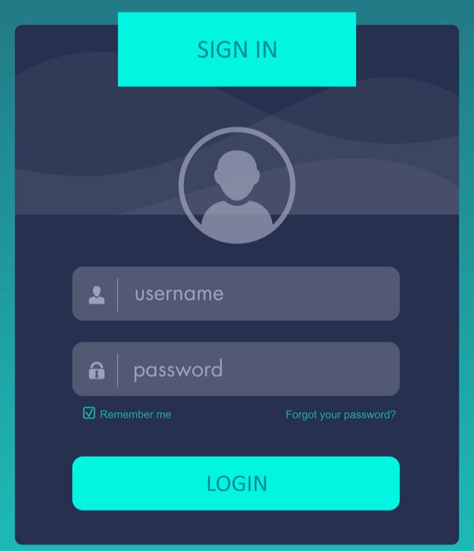

# What is SQL

A structured query language (SQL) is a programming language for storing and proccessing information into a Database

For Example :
assume the target Web application have the following login form 



and there is the following table in the DB

| username | password      |
| -------- | ------------- |
| abdallah | abd123456     |
| ahmed    | 12-gg123      |
| admin    | admin12345678 |

when the user pass data the web application will use a query like the this to check if the user exists or not

```SQL
select username, password from users where username = 'inputdata' and password = 'inputdata' 
```

__if the user pass abdallah as username and abd123456 as password__

* the query will return a result thus the user is authunticated 

__if he pass wrong data__

* the query will return no results thus the user will not be authunticated

# What is SQL injection

it is a type of attacks that occurs when the end user is able to inject code into a SQL statment statment that the target web application uses to access the database 

For example : 

__if the user pass "admin ' or 1=1 --" as a user name and a random password__

what will happen in this case ?

the SQL query would be like this 

```SQL
select username, password from users where username = 'admin' or 1=1  -- ' and password = 'fgffsgg'
```

- as you can see the user has alterd the original syntax 
- so the resulted query will check if the username exists or not which is __true__ in our case 
- secondly it will check if 1=1 which is also __true__  
- note that the password condition has been disable cause of -- (comment in SQL)

# How to check for SQLi ? 
the easiest way to check for SQLi is to insert speacial charachter in fields that is send for the back-end and check for the respone, if you got internal error this indicates that the speacial charachter broke the SQL syntax

